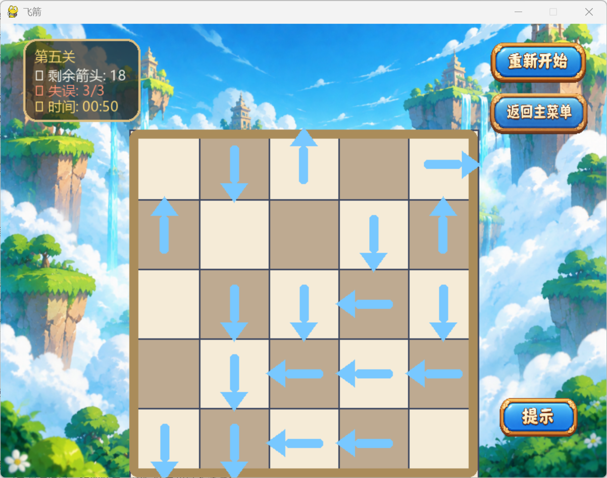
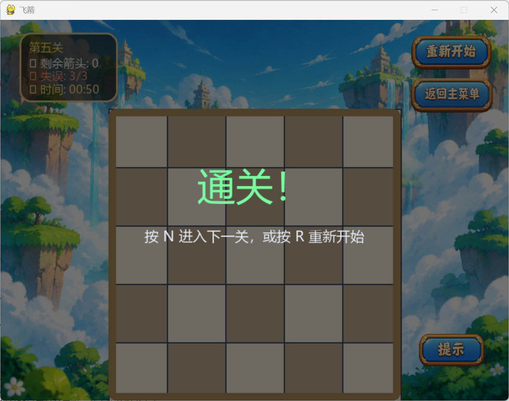
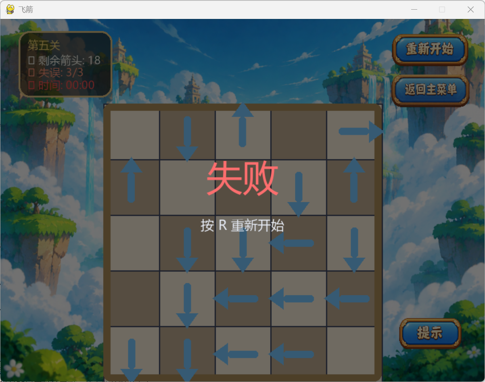

# 《飞箭》小游戏游玩指南
### 项目名称：飞箭
### 游戏简介：
 参考微信小游戏《一箭又一箭》核心玩法制作的基础玩法，玩家通过观察箭头方向，当箭头前方无其他箭头阻碍时点击箭头，使得箭头飞出网格，将键盘上全部箭头飞出后取得游戏胜利。
### 开发环境：
- 操作系统：Windows
- 编译语言：Python（版本3.12.9）
- 编译器：PyCharm
- 软件包：pygame
### 安装和运行方法：
 下载ArrowArrow.exe即可运行（暂未放进仓库中，目前可通过下载ArrowArrow文件夹后点击其中的main.py来运行该文件）
### 游戏操作说明：
- 网格中有上、下、左、右四个方向的箭头，玩家通过点击箭头来让箭头飞出网格外，
- 请注意，在一个箭头飞出的方向上有其他箭头阻挡时，该箭头不可以飞出。
- 只有将箭头飞出方向的其他箭头一一清除，才能将该箭头飞出，将所有箭头全部飞出后即可取得游戏胜利。
### 游戏截图：

### 制作过程：
- commit：完成开始界面；
- commit：将游戏拆分成多个文件管理，加入了游戏界面、关卡选择界面、成就系统；
- problem：试玩关卡过程中，发现箭头会在飞出一格后直接消失、同时在一个箭头前方存在与这个箭头相同方向的箭头时会错误的能够成功飞出、一个箭头前方即使没有障碍也不能飞出的问题，每个关卡箭头的生成不是随机的而是按照给定方式生成；
- fix：修复了箭头错误飞出的问题，同时添加了随机生成箭头的功能，让箭头能直接飞到屏幕外
- fix：修复了原先随机生成箭头会导致无解的问题，完善了关卡随机生成的代码，保证每一关必定有解
- commit：上传了设置相关文件，添加了音乐和音效
- commit：为开始界面添加了背景，使用AI生图优化了原来开始界面的按钮
- commit：优化了游戏界面，增加了提示功能，点击提示会使一个可飞出箭头变绿
- fix：修复了音效无法正确发出的问题
- commit：增加了三个关卡，增加了在限时关卡中显示倒计时的功能
### 小记：
 看完作业要求后，我首先去玩了这个微信小游戏，作为一个玩到26关的人，我总结了这个游戏存在的几个问题：
- 箭头过细，在点击时容易点击到其他箭头；
- 没有容错，点到其他箭头之后会直接让箭头飞出，直接失误（我觉得可以通过让箭头可以点击两次，第一次是选中，第二次是让箭头飞出，或者增加误触撤回功能）；
- 关卡难度不是逐级递增，感觉有的关简单有的关难的，而且直到十几关还是二十关才出现粗箭头的额外玩法，额外玩法出的太迟了。

所以我在设计小游戏的过程中先考虑了这几点（但是游戏使用了网格，感觉不太会导致误触，而且箭头挺大的，所以目前没有添加相应功能，过几天添加了会修改）而准备增加相对应的功能。
  

